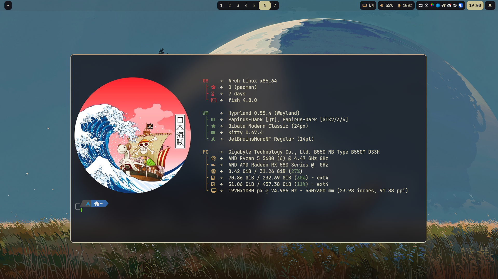
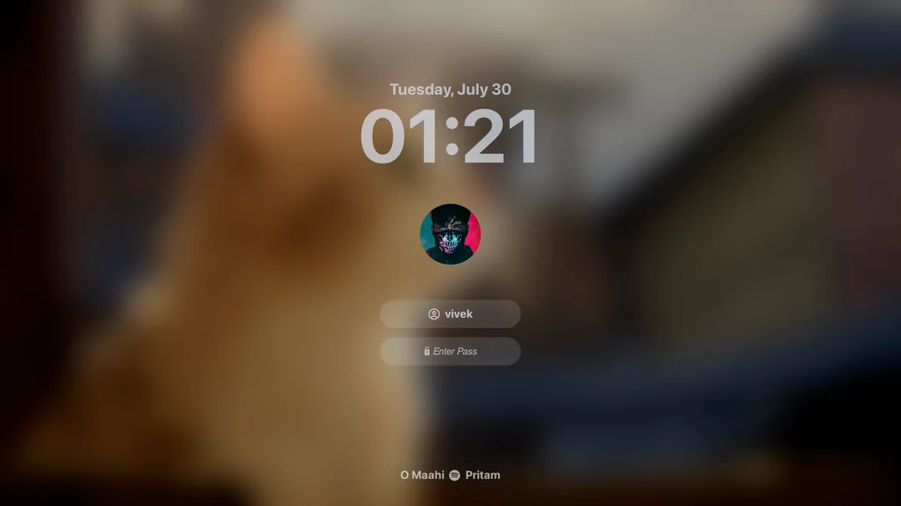
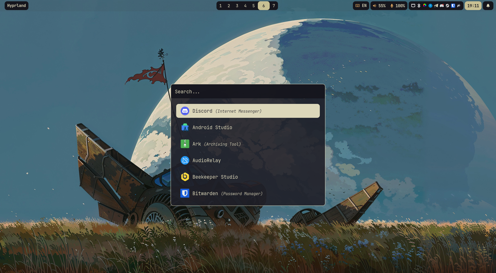
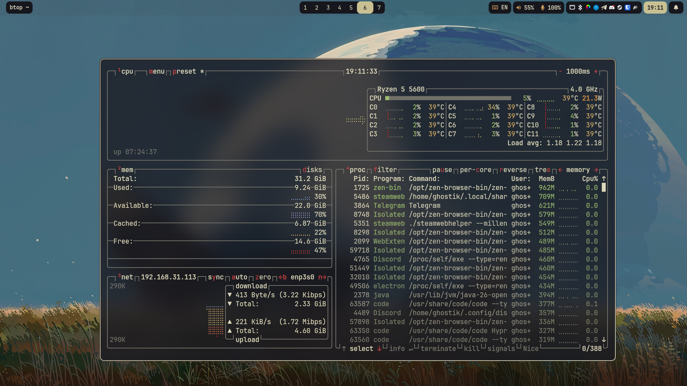
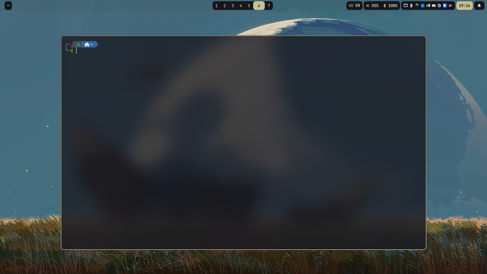
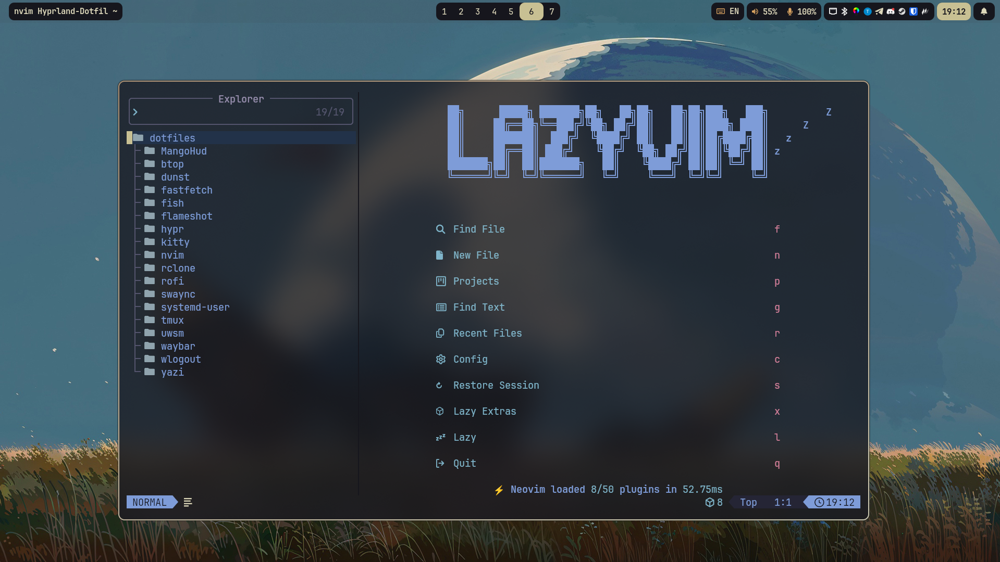
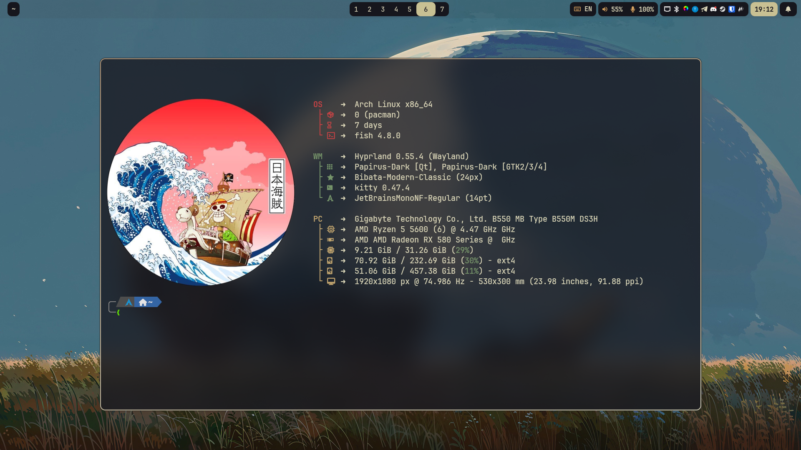
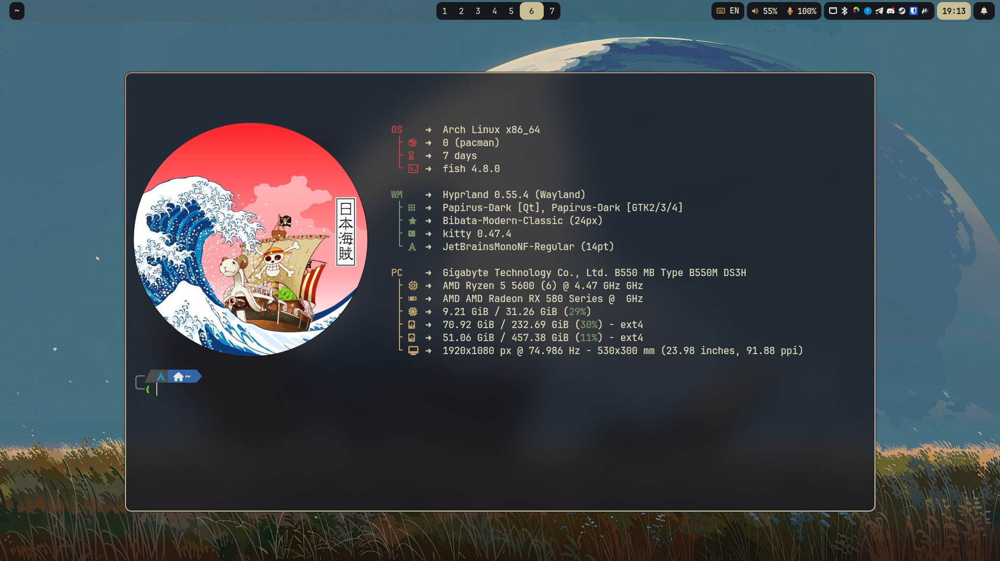
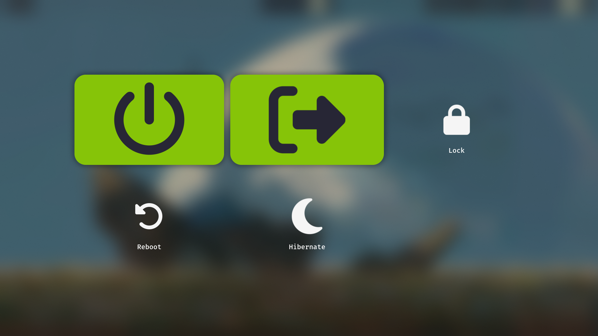

# My Hyprland Dotfiles

  

## Beautiful, lightweight Hyprland configuration for daily use.

| Component | Tool | Role |
|---|---|---|
| Window Manager | Hyprland | Dynamic tiling Wayland compositor |
| Status Bar | Waybar | Fully configurable bar |
| Terminal | Kitty | GPU-accelerated terminal emulator |
| Shell | Fish | Fast user friendly shell |
| Launcher | Rofi | App launcher and dmenu replacement |
| Notifications | Swaync / Dunst | Notification daemons |
| Lockscreen | Hyprlock + Hypridle | GPU-accelerated lock with idle management |
| TUI File Manager | Yazi | Blazing-fast terminal file manager |
| GUI File Manager | Dolphin | Beautiful file manager |
| Editor | Neovim | Extensible modal text editor |
| Wallpaper | awww | GPU-accelerated Wayland wallpaper daemon |
| Clipboard | Flameshot | GUI screenshot application |
| Audio | PavuControl | Graphic sound mixer |
| Logout | Wlogout | Clean session management screen |
| System Info | Fastfetch | Fast, customisable fetch tool |
| AUR Helper | yay | AUR package manager |

#

...

#

<table><tr><td>HyprLock</td><td>Rofi</td><td>Btop</td></tr><tr><td>
</td><td>
</td></tr></table>

</td><td>

<table><tr><td>Kitty</td><td>NeoVim</td><td>FastFetch</td></tr><tr><td>
</td><td>
</td><td>
</td></tr></table>

<table><tr><td>Wallpaper Select</td><td>Wlogout</td></tr><tr><td>
</td></tr></table>

</td><td>

#

- [ ] Auto installer
- [ ] Theme switcher

#

  
Made with ❤️ by <a href="https://github.com/GhOsTiK56">GhOsTiK56</a>

  
<i>Happy hacking.</i>

  Last edited on: 2025

